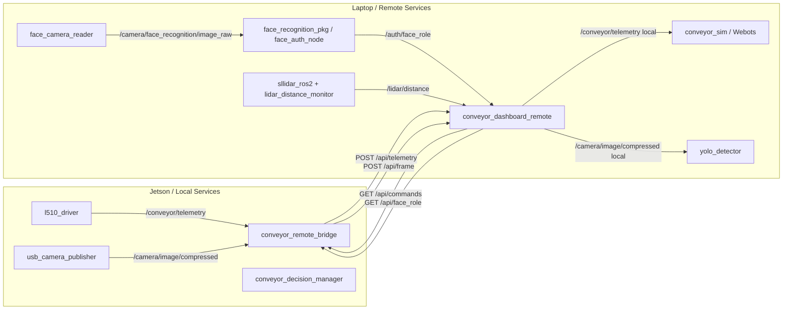
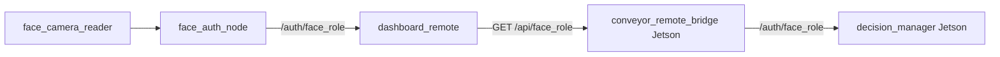

# ros2-conveyor-remote-services

<div align="center">

# 🖥️ ROS2 Conveyor Remote Services

**Remote laptop services for a ROS2 conveyor belt system.**

Servicios remotos para visualización, percepción, autorización facial, LiDAR, YOLO y simulación digital de una banda transportadora controlada desde una NVIDIA Jetson.

</div>

---

## 📌 Descripción general

`ros2-conveyor-remote-services` contiene los paquetes que corren principalmente en la **laptop externa** dentro del sistema de banda transportadora.

Este repositorio complementa al repositorio local de la Jetson:

```text
ros2-conveyor-local-services
```

Mientras la Jetson se encarga del control físico de la banda, este repositorio se encarga de:

- Dashboard remoto web.
- Recepción de telemetría enviada desde la Jetson.
- Envío de comandos hacia la Jetson mediante endpoints HTTP.
- Streaming de cámara remota.
- Procesamiento YOLO.
- Reconocimiento facial y autorización de usuarios.
- LiDAR S3 y monitor de distancia.
- Simulación digital en Webots usando la telemetría real.
- Publicación local de tópicos ROS2 para análisis, visualización y digital twin.

---

## 🧠 Arquitectura general

El sistema completo está dividido en dos capas:

```text
┌──────────────────────────────────────────────┐
│                 LAPTOP EXTERNA               │
│        ros2-conveyor-remote-services         │
│                                              │
│  conveyor_dashboard_remote                   │
│  face_camera_reader                          │
│  face_recognition_pkg                        │
│  yolo_detector                               │
│  camera_reader_pkg                           │
│  lidar_distance_monitor                      │
│  sllidar_ros2                                │
│  conveyor_sim                                │
│                                              │
│  ROS2 Jazzy                                  │
└──────────────────────▲───────────────────────┘
                       │ HTTP / Ethernet
                       ▼
┌──────────────────────────────────────────────┐
│                  NVIDIA JETSON               │
│         ros2-conveyor-local-services         │
│                                              │
│  conveyor_remote_bridge                      │
│  conveyor_decision_manager                   │
│  l510_driver                                 │
│  conveyor_hmi                                │
│  usb_camera_publisher                        │
│  voice_remote_bridge                         │
│  conveyor_joystick                           │
│                                              │
│  ROS2 Humble                                 │
└──────────────────────▼───────────────────────┘
                       │ RS485 Modbus RTU
                       ▼
┌──────────────────────────────────────────────┐
│           TECO L510 + Banda real             │
└──────────────────────────────────────────────┘
```

---

## 🔁 Flujo Jetson ↔ Laptop



---

## 📦 Paquetes incluidos

```text
ros2-conveyor-remote-services/
└── src/
    ├── camera_reader_pkg/
    ├── conveyor_dashboard_remote/
    ├── conveyor_sim/
    ├── face_camera_reader/
    ├── face_recognition_pkg/
    ├── lidar_distance_monitor/
    ├── sllidar_ros2/
    └── yolo_detector/
```

---

# 📦 Descripción de paquetes

## 1. `conveyor_dashboard_remote`

Dashboard web remoto basado en **FastAPI**, **WebSocket** y ROS2.

Es el punto central de comunicación entre la laptop y la Jetson.

### Funciones principales

- Muestra telemetría de la banda.
- Muestra video original recibido desde Jetson.
- Muestra video procesado con YOLO.
- Envía comandos remotos:
  - `forward`
  - `reverse`
  - `stop`
  - `emergency_stop`
  - `set_speed`
- Publica telemetría local en ROS2 para la simulación.
- Recibe y expone autorización facial.
- Expone endpoints HTTP consumidos por la Jetson.

### Tópicos ROS2

| Tópico | Tipo | Dirección | Descripción |
|---|---|---|---|
| `/conveyor/cmd` | `std_msgs/String` | Pub | Comandos locales generados desde dashboard |
| `/conveyor/telemetry` | `std_msgs/String` | Pub/Sub | Telemetría recibida desde Jetson y republicada localmente |
| `/camera/image/compressed` | `sensor_msgs/CompressedImage` | Pub | Imagen remota recibida desde Jetson |
| `/auth/face_role` | `std_msgs/String` | Sub | Rol facial detectado localmente |
| `/lidar/distance` | `std_msgs/String` | Sub | Estado procesado del LiDAR |

### Endpoints HTTP

| Método | Endpoint | Descripción |
|---|---|---|
| `GET` | `/` | Interfaz web |
| `POST` | `/cmd` | Recibe comandos desde la UI web |
| `GET` | `/api/commands` | Jetson consulta comandos pendientes |
| `POST` | `/api/telemetry` | Jetson envía telemetría del L510 |
| `GET` | `/api/telemetry` | Consulta última telemetría |
| `POST` | `/api/frame` | Jetson envía frame JPEG comprimido |
| `GET` | `/video` | Stream MJPEG original |
| `POST` | `/api/yolo` | Recibe inferencia YOLO |
| `GET` | `/api/yolo` | Consulta inferencia YOLO |
| `POST` | `/api/yolo_frame` | Recibe frame procesado con YOLO |
| `GET` | `/video_yolo` | Stream MJPEG procesado con YOLO |
| `POST` | `/api/face_role` | Recibe rol facial |
| `GET` | `/api/face_role` | Jetson consulta rol facial |
| `GET` | `/api/lidar` | Consulta último estado LiDAR |
| `GET` | `/api/status` | Estado general del sistema |
| `WS` | `/ws` | Actualización en tiempo real |

### Formato de comandos

```json
{"action":"forward"}
```

```json
{"action":"reverse"}
```

```json
{"action":"stop"}
```

```json
{"action":"emergency_stop"}
```

```json
{"action":"set_speed","hz":10.0,"speed_hz":10.0}
```

### Formato de telemetría

```json
{
  "state": 7,
  "error": 0,
  "freq_cmd_hz": 10.0,
  "freq_out_hz": 9.8,
  "current_raw": 5,
  "timestamp": 1780000000.0
}
```

### Ejecutar con `ros2 run`

```bash
ros2 run conveyor_dashboard_remote dashboard_remote_node
```

### Ejecutar servicios remotos

```bash
ros2 launch conveyor_dashboard_remote local_services.launch.py
```

---

## 2. `camera_reader_pkg`

Paquete para lectura de cámara general en la laptop.

Se utiliza para publicar imágenes en ROS2 cuando se requiere una cámara local adicional o pruebas de visión.

### Funciones principales

- Abrir cámara por índice.
- Publicar imagen en ROS2.
- Servir como fuente de video para pruebas de visión.

### Tópicos típicos

| Tópico | Tipo | Descripción |
|---|---|---|
| `/camera/image_raw` | `sensor_msgs/Image` | Imagen sin comprimir |
| `/camera/image/compressed` | `sensor_msgs/CompressedImage` | Imagen comprimida si aplica |

### Ejecutar

Consultar ejecutables:

```bash
ros2 pkg executables camera_reader_pkg
```

Ejemplo típico:

```bash
ros2 run camera_reader_pkg camera_reader_node   --ros-args   -p camera_id:=0   -p image_topic:=/camera/image_raw
```

---

## 3. `face_camera_reader`

Nodo dedicado para la cámara exclusiva de reconocimiento facial.

Este paquete existe para separar la cámara de YOLO/dashboard de la cámara usada para autenticación facial.

### Funciones principales

- Lee una cámara USB específica para rostros.
- Publica frames en `/camera/face_recognition/image_raw`.
- Permite usar dos cámaras simultáneas:
  - una para YOLO/banda
  - otra para face auth

### Tópicos

| Tópico | Tipo | Dirección |
|---|---|---|
| `/camera/face_recognition/image_raw` | `sensor_msgs/Image` | Pub |

### Ejecutar

```bash
ros2 run face_camera_reader face_camera_node   --ros-args   -p camera_id:=2   -p image_topic:=/camera/face_recognition/image_raw   -p width:=640   -p height:=480   -p fps:=15.0
```

---

## 4. `face_recognition_pkg`

Paquete de reconocimiento y autorización facial.

Contiene una base de datos local de rostros organizada por roles:

```text
face_database/
├── jefe/
├── trabajador/
└── otros/
```

### Nodos principales

| Ejecutable | Descripción |
|---|---|
| `face_recognition_node` | Nodo de reconocimiento facial visual |
| `face_auth_node` | Nodo de autorización que publica `/auth/face_role` |
| `preprocess_faces` | Preprocesamiento de imágenes |
| `register_faces_offline` | Registro offline de rostros |

### `face_auth_node`

Este es el nodo usado para la capa de seguridad.

Lee:

```text
/camera/face_recognition/image_raw
```

y publica:

```text
/auth/face_role
```

### Formato de `/auth/face_role`

```json
{
  "role": "jefe",
  "name": "didier",
  "confidence": 0.87,
  "face_detected": true,
  "timestamp": 1780000000.0
}
```

### Roles válidos

| Rol | Significado |
|---|---|
| `jefe` | Usuario autorizado para todos los comandos |
| `trabajador` | Usuario autorizado solo para detener |
| `otro` | Usuario registrado sin privilegios |
| `unknown` | Cara detectada pero no reconocida |
| `none` | No se detectó cara |

### Ejecutar Face Auth

```bash
ros2 run face_recognition_pkg face_auth_node   --ros-args   -p image_topic:=/camera/face_recognition/image_raw   -p database_path:=/home/darhf/jazzy_ws/src/face_recognition_pkg/face_database   -p auth_topic:=/auth/face_role   -p show_window:=true   -p recognition_threshold:=65.0
```

### Ver autorización

```bash
ros2 topic echo /auth/face_role
```

---

## 5. `yolo_detector`

Nodo de detección de objetos usando YOLO.

### Funciones principales

- Recibir imagen comprimida o cruda.
- Ejecutar inferencia YOLO.
- Dibujar bounding boxes.
- Enviar resultados al dashboard remoto.
- Enviar frame procesado a `/api/yolo_frame`.
- Enviar detecciones a `/api/yolo`.

### Flujo

```text
/camera/image/compressed
        ↓
yolo_detector
        ↓
POST /api/yolo
POST /api/yolo_frame
        ↓
dashboard remoto
```

### Ejecutar

Si existe launch:

```bash
ros2 launch yolo_detector yolo_detector.launch.py
```

Consultar ejecutables:

```bash
ros2 pkg executables yolo_detector
```

Ejemplo típico:

```bash
ros2 run yolo_detector yolo_detector_node   --ros-args   -p image_topic:=/camera/image/compressed   -p use_compressed:=true   -p dashboard_url:=http://localhost:8000
```

---

## 6. `conveyor_sim`

Simulación / Digital Twin de la banda usando Webots.

### Función principal

Representar visualmente el estado de la banda real usando la telemetría recibida desde la Jetson.

La simulación no controla la banda real. Solo consume telemetría:

```text
/conveyor/telemetry
```

y anima:

- caja
- banda
- marcas
- rodillos si están habilitados

### Arquitectura final

Como Webots instalado por Snap usa Python aislado, el controller no importa `rclpy`.

La arquitectura usa archivo JSON compartido en HOME:

```text
/conveyor/telemetry
        ↓
conveyor_sim_node
        ↓
~/conveyor_sim_state.json
        ↓
Webots controller
        ↓
Digital Twin
```

No se usa `/tmp` porque Snap puede aislarlo.

### Ejecutar simulación

```bash
ros2 launch conveyor_sim conveyor_sim.launch.py
```

### Probar simulación manual

```bash
ros2 topic pub /conveyor/telemetry std_msgs/msg/String "{data: '{"state":5,"error":0,"freq_out_hz":10.0}'}" -r 10
```

### Ver estado simulado

```bash
watch -n 0.2 cat ~/conveyor_sim_state.json
```

---

## 7. `sllidar_ros2`

Driver ROS2 para LiDAR SLLidar/RPLidar.

En este proyecto se utiliza con un **RPLidar / SLLidar S3**.

### Alias recomendado

El LiDAR en la laptop usa un adaptador CP210x:

```text
10c4:ea60 Silicon Labs CP210x UART Bridge
```

Alias recomendado:

```text
/dev/lidar_usb
```

### Ejecutar S3

```bash
ros2 launch sllidar_ros2 sllidar_s3_launch.py   serial_port:=/dev/lidar_usb   serial_baudrate:=256000
```

### Verificar `/scan`

```bash
ros2 topic list | grep scan
ros2 topic hz /scan
```

### Visualizar en RViz

```bash
ros2 launch sllidar_ros2 view_sllidar_s3_launch.py   serial_port:=/dev/lidar_usb
```

---

## 8. `lidar_distance_monitor`

Nodo que procesa `/scan` para detectar objetos dentro de una ventana angular y rango de distancia.

### Funciones principales

- Suscribirse a `/scan`.
- Tomar una ventana angular configurable.
- Calcular:
  - distancia mínima frontal
  - ángulo de distancia mínima
  - promedio frontal
  - mínimo global
- Detectar objeto si la distancia cae dentro de un rango calibrado.

### Rango calibrado para objeto

```text
0.0579 m <= distancia <= 0.235 m
```

### Tópicos

| Tópico | Tipo | Dirección | Descripción |
|---|---|---|---|
| `/scan` | `sensor_msgs/LaserScan` | Sub | LiDAR crudo |
| `/lidar/distance` | `std_msgs/String` | Pub | JSON procesado |
| `/lidar/front_distance` | `std_msgs/Float32` | Pub | Distancia mínima frontal |

### Payload de salida

```json
{
  "detected": true,
  "front_min_m": 0.12,
  "front_min_angle_deg": 184.5,
  "front_avg_m": 0.15,
  "global_min_m": 0.10,
  "global_min_angle_deg": 182.0,
  "samples_used": 42,
  "front_angle_deg": 180.0,
  "window_deg": 10.0,
  "presence_min_m": 0.0579,
  "presence_max_m": 0.235,
  "hits_in_range": 8,
  "avg_recent_m": 0.13
}
```

### Ejecutar

```bash
ros2 run lidar_distance_monitor lidar_distance_node   --ros-args   -p scan_topic:=/scan   -p distance_topic:=/lidar/distance   -p front_distance_topic:=/lidar/front_distance   -p front_angle_deg:=180.0   -p window_deg:=10.0   -p presence_min_m:=0.0579   -p presence_max_m:=0.235
```

---

# 🚀 Launch principal de remote services

El launch recomendado para correr los servicios remotos de laptop integra:

- Dashboard remoto
- Cámara facial
- Face auth
- YOLO
- Conveyor sim + Webots
- LiDAR S3
- Lidar distance monitor

```bash
ros2 launch conveyor_dashboard_remote local_services.launch.py
```

Con cámara facial explícita:

```bash
ros2 launch conveyor_dashboard_remote local_services.launch.py   face_camera_id:=2
```

---

# 🔌 Tópicos ROS2 principales

| Tópico | Tipo | Productor | Consumidor |
|---|---|---|---|
| `/conveyor/telemetry` | `std_msgs/String` | dashboard remote | conveyor_sim |
| `/conveyor/cmd` | `std_msgs/String` | dashboard remote local | pruebas/local |
| `/camera/image/compressed` | `sensor_msgs/CompressedImage` | dashboard remote | yolo_detector |
| `/camera/face_recognition/image_raw` | `sensor_msgs/Image` | face_camera_reader | face_auth_node |
| `/auth/face_role` | `std_msgs/String` | face_auth_node | dashboard remote |
| `/scan` | `sensor_msgs/LaserScan` | sllidar_ros2 | lidar_distance_monitor |
| `/lidar/distance` | `std_msgs/String` | lidar_distance_monitor | dashboard remote |
| `/lidar/front_distance` | `std_msgs/Float32` | lidar_distance_monitor | debug/visualización |

---

# 🌐 Endpoints expuestos por `conveyor_dashboard_remote`

| Método | Endpoint | Descripción |
|---|---|---|
| `GET` | `/` | Dashboard web |
| `POST` | `/cmd` | Recibe comandos desde UI |
| `GET` | `/api/commands` | Jetson lee comandos pendientes |
| `POST` | `/api/telemetry` | Jetson envía telemetría |
| `GET` | `/api/telemetry` | Consulta última telemetría |
| `POST` | `/api/frame` | Jetson envía cámara JPEG |
| `GET` | `/video` | Stream MJPEG original |
| `POST` | `/api/yolo` | Recibe detecciones YOLO |
| `GET` | `/api/yolo` | Consulta detecciones |
| `POST` | `/api/yolo_frame` | Recibe frame procesado |
| `GET` | `/video_yolo` | Stream MJPEG YOLO |
| `POST` | `/api/face_role` | Recibe rol facial |
| `GET` | `/api/face_role` | Jetson consulta rol facial |
| `GET` | `/api/lidar` | Consulta LiDAR procesado |
| `GET` | `/api/status` | Estado general |
| `WS` | `/ws` | Actualización en tiempo real |

---

# 🔐 Seguridad por autorización facial

La autorización facial se ejecuta en laptop y se transmite a la Jetson por el dashboard.



### Roles

| Rol | Permisos en Jetson |
|---|---|
| `jefe` | Todos los comandos |
| `trabajador` | Solo detener |
| `otro` | Bloqueado |
| `unknown` | Bloqueado |
| `none` | Modo normal |

---

# 🧪 Comandos de prueba

## Dashboard

```bash
ros2 run conveyor_dashboard_remote dashboard_remote_node
```

## Publicar telemetría falsa

```bash
ros2 topic pub /conveyor/telemetry std_msgs/msg/String "{data: '{"state":5,"error":0,"freq_out_hz":10.0,"freq_cmd_hz":10.0,"current_raw":5}'}" -r 10
```

## Probar face role

```bash
ros2 topic pub --once /auth/face_role std_msgs/msg/String "{data: '{"role":"jefe","name":"didier","confidence":0.9,"face_detected":true}'}"
```

Consultar:

```bash
curl http://localhost:8000/api/face_role
```

## Probar LiDAR

```bash
ros2 launch sllidar_ros2 sllidar_s3_launch.py   serial_port:=/dev/lidar_usb   serial_baudrate:=256000
```

```bash
ros2 run lidar_distance_monitor lidar_distance_node
```

```bash
ros2 topic echo /lidar/distance
```

## Probar Webots sim

```bash
ros2 launch conveyor_sim conveyor_sim.launch.py
```

---

# ⚙️ Instalación

## 1. Crear workspace

```bash
mkdir -p ~/jazzy_ws/src
cd ~/jazzy_ws/src
```

## 2. Clonar repositorio

```bash
git clone https://github.com/DidierHernandez2/ros2-conveyor-remote-services.git
```

## 3. Instalar dependencias ROS2

```bash
sudo apt update
sudo apt install -y   ros-jazzy-cv-bridge   ros-jazzy-sensor-msgs   ros-jazzy-std-msgs   ros-jazzy-webots-ros2   ros-jazzy-webots-ros2-driver   python3-pip   v4l-utils
```

## 4. Entorno Python

```bash
cd ~/jazzy_ws
python3 -m venv venv
source venv/bin/activate
pip install --upgrade pip
```

Dependencias comunes:

```bash
pip install   fastapi   uvicorn[standard]   websockets   requests   numpy   opencv-contrib-python   ultralytics
```

> `opencv-contrib-python` es necesario para `cv2.face.LBPHFaceRecognizer_create()` en el nodo de autorización facial.

## 5. Compilar

```bash
cd ~/jazzy_ws
source venv/bin/activate
source /opt/ros/jazzy/setup.bash

colcon build --symlink-install

source install/setup.bash
```

---

# 🔗 Alias persistente para LiDAR

El LiDAR S3 usa CP210x:

```text
idVendor  = 10c4
idProduct = ea60
serial    = 464ecdafe963ef11a7bce0a9c169b110
```

Crear regla:

```bash
sudo nano /etc/udev/rules.d/99-lidar.rules
```

```text
SUBSYSTEM=="tty", ATTRS{idVendor}=="10c4", ATTRS{idProduct}=="ea60", ATTRS{serial}=="464ecdafe963ef11a7bce0a9c169b110", SYMLINK+="lidar_usb", MODE="0666", GROUP="dialout"
```

Recargar:

```bash
sudo udevadm control --reload-rules
sudo udevadm trigger
```

Verificar:

```bash
ls -l /dev/lidar_usb
readlink -f /dev/lidar_usb
```

---

# 🌉 Red Jetson ↔ Laptop

Ejemplo de configuración usada:

| Equipo | Interfaz | IP |
|---|---|---|
| Laptop | Ethernet | `192.168.50.1` |
| Jetson | Ethernet | `192.168.50.2` |

La Jetson debe poder alcanzar el dashboard:

```bash
curl http://192.168.50.1:8000/api/status
```

El bridge de Jetson debe usar:

```bash
-p server_url:=http://192.168.50.1:8000
```

---

# 🧯 Troubleshooting

## `local_services.launch.py` no encontrado

Asegurar que `setup.py` instale la carpeta `launch`:

```python
from glob import glob
import os

data_files=[
    ('share/ament_index/resource_index/packages', ['resource/' + package_name]),
    ('share/' + package_name, ['package.xml']),
    (os.path.join('share', package_name, 'launch'), glob('launch/*.py')),
]
```

Recompilar:

```bash
colcon build --symlink-install --packages-select conveyor_dashboard_remote
source install/setup.bash
```

## Dashboard WebSocket no funciona

Instalar:

```bash
pip install "uvicorn[standard]" websockets
```

## Face Auth falla con `cv2.face`

Instalar OpenCV contrib:

```bash
pip uninstall -y opencv-python opencv-python-headless opencv-contrib-python
pip install opencv-contrib-python
```

Verificar:

```bash
python3 - << 'EOF'
import cv2
print(hasattr(cv2, "face"))
EOF
```

## Webots no lee JSON de simulación

Si Webots está instalado por Snap, no usar `/tmp`.

Usar:

```text
/home/darhf/conveyor_sim_state.json
```

Verificar:

```bash
watch -n 0.2 cat ~/conveyor_sim_state.json
```

## LiDAR timeout

Si aparece:

```text
SL_RESULT_OPERATION_TIMEOUT
```

Verificar:

```bash
ls -l /dev/lidar_usb
sudo lsof /dev/lidar_usb
```

Para S3 usar:

```bash
ros2 launch sllidar_ros2 sllidar_s3_launch.py   serial_port:=/dev/lidar_usb   serial_baudrate:=256000
```

## Cámara equivocada en Face Auth

Probar índices:

```bash
python3 - << 'EOF'
import cv2
for i in range(6):
    cap = cv2.VideoCapture(i)
    print(i, cap.isOpened())
    cap.release()
EOF
```

Luego lanzar:

```bash
ros2 launch conveyor_dashboard_remote local_services.launch.py face_camera_id:=2
```

---

# 🧭 Comandos útiles

## Ver tópicos

```bash
ros2 topic list
```

## Ver nodos

```bash
ros2 node list
```

## Ver telemetría

```bash
ros2 topic echo /conveyor/telemetry
```

## Ver auth facial

```bash
ros2 topic echo /auth/face_role
```

## Ver LiDAR procesado

```bash
ros2 topic echo /lidar/distance
```

## Ver cámara facial

```bash
ros2 topic hz /camera/face_recognition/image_raw
```

## Ver cámara comprimida

```bash
ros2 topic hz /camera/image/compressed
```

---

# ✅ Estado final del repositorio

Este repositorio implementa la capa remota del sistema:

```text
Percepción + Dashboard + Simulación + Autorización
```

y se comunica con la Jetson mediante endpoints HTTP.

La Jetson mantiene el control físico y este repositorio se encarga de:

- visualizar
- analizar
- autorizar
- simular
- monitorear
- enviar comandos remotos

---

# 👥 Equipo

Proyecto desarrollado para el sistema de banda transportadora del equipo **Fantastic Four**.

---

# 📄 Licencia

Pendiente de definir.
